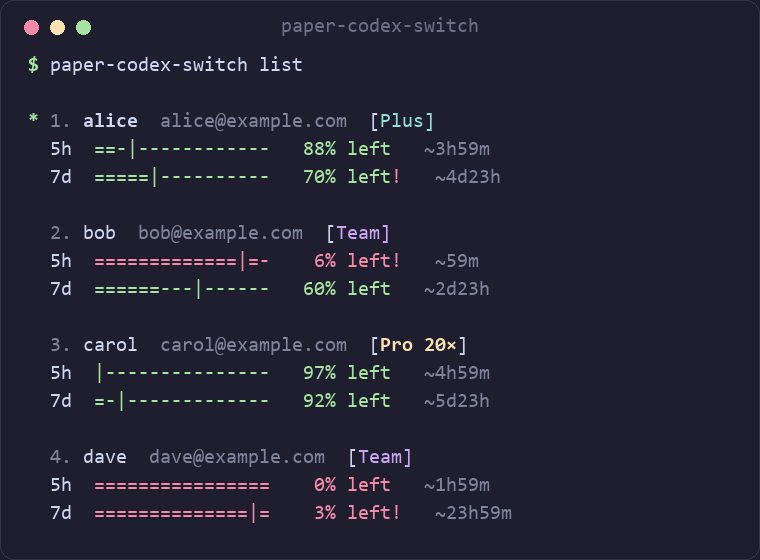

# paper-codex-switch

**Multi-account switcher for [OpenAI Codex CLI](https://github.com/openai/codex), with automatic swap before you hit a usage limit.**

Save several Codex logins, see every account's 5-hour and weekly quota in one dashboard, switch with one command, and let `auto` move you to a fresh account before the active one runs dry.



> Inspired by [codex-switch](https://github.com/xjoker/codex-switch) and [claude-swap](https://github.com/realiti4/claude-swap). Example output above uses made-up accounts.

## Features

- Save, import, rename and recoverably delete Codex profiles; switch by name, by number, or to the best account automatically.
- Usage dashboard (CLI `list` and interactive `tui`) for the 5h and 7d windows, plan, reset cards, and the date each plan runs until (`Plan until`, yellow in the last 7 days).
- **`auto`**: loop that switches accounts when the active one nears its limit (leave the window open, minimized).
- **`launch --auto-swap`**: run Codex and, at the threshold, restart the session on a better account with `codex resume --last`.
- Custom Responses-compatible API providers (beta), proxies, JSON output.
- Windows, macOS and Linux.

## Requirements

- [Codex CLI](https://github.com/openai/codex) 0.159.2 or newer on `PATH` (`paper-codex-switch doctor` checks).
- Codex must use the file credential store. Add to `~/.codex/config.toml`:

  ```toml
  cli_auth_credentials_store = "file"
  ```

## Install

```bash
npm i -g paper-codex-switch
```

This downloads the prebuilt binary for your platform (Windows x64, macOS x64/arm64, Linux x64) from [GitHub Releases](https://github.com/Cazorlas/Paper.Codex-switcher/releases). Node 18+ is the only prerequisite.

Or build from source (Rust 1.88+):

```bash
cargo install --git https://github.com/Cazorlas/Paper.Codex-switcher
```

Data lives in `~/.paper-codex-switch` (override with `PAPER_CODEX_SWITCH_HOME`). Update with `paper-codex-switch self-update`.

## Setup (first time)

1. Install Codex CLI (0.159.2+) and make sure it uses the file credential store (see Requirements).
2. Install paper-codex-switch (see Install) and check everything with:
   ```bash
   paper-codex-switch doctor
   ```
3. Add your accounts, one `login` per account (a browser opens; use `--device` on a headless machine):
   ```bash
   paper-codex-switch login personal
   paper-codex-switch login work
   ```
   Already signed in to Codex with another account? Just run `paper-codex-switch list`: it detects the account in `~/.codex/auth.json` and offers to save it.
4. Check them: `paper-codex-switch list`.

## Everyday use

```bash
paper-codex-switch list           # numbered usage dashboard (5h and 7d windows)
paper-codex-switch use            # switch to the best account
paper-codex-switch use 2          # switch to account number 2 in `list`
paper-codex-switch use work       # ...or by alias
paper-codex-switch launch         # start Codex on the best account
paper-codex-switch tui            # interactive dashboard (in a narrow window each account becomes a stacked block)
paper-codex-switch auto           # switch automatically near the limit (see below)
```


The plan end date comes from the account's login token, so it is as fresh as the last token refresh; `lapsed?` means the recorded end has passed (the plan ended, or it renewed and the token has not refreshed yet; `list --force` or `login <alias>` refreshes it). `--json list` has it as `account.subscription_until` (unix seconds).

`use <n>` uses the numbers shown by `list` (alphabetical by alias); a profile literally named `2` wins over position 2.

## Manage accounts

| Task | Command |
|---|---|
| Add an account | `paper-codex-switch login [alias]` |
| Re-authorize an expired account | `paper-codex-switch login <existing alias>` |
| Import an `auth.json` file or a folder of them | `paper-codex-switch import <path> [alias]` |
| Rename | `paper-codex-switch rename <old> <new>` |
| Delete (archived, recoverable; the active account can't be deleted) | `paper-codex-switch delete <alias> [--yes]` |
| List deleted accounts / bring one back | `paper-codex-switch restore` / `paper-codex-switch restore <alias> [--as <new>]` |
| Refresh usage now, ignoring the cache | `paper-codex-switch list --force` |
| Start the 5h timer of a fresh account | `paper-codex-switch warmup [alias]` |
| Use a reset card on an account | `paper-codex-switch reset-card <alias>` |
| Open the data folder | `paper-codex-switch open` |
| Check Codex version and setup | `paper-codex-switch doctor` |

Global flags: `--json` / `--json-pretty` (machine-readable output), `--proxy <url>`, `--color always|never`, `--debug`. Settings live in `~/.paper-codex-switch/config.toml` (also editable in the `tui` Settings tab).

To remove accounts you no longer use: `list`, then `delete <alias>`. Deleting is not final: `restore` lists what was deleted and `restore <alias>` brings the newest archive back (use `--as` if the name is taken). Archives live in `~/.paper-codex-switch/deleted-profiles`. `auto` only ever switches between accounts that are saved, so deleting an account also takes it out of rotation.

### Update / uninstall

```bash
paper-codex-switch self-update --check   # is there a newer version?
paper-codex-switch self-update           # update (npm installs)
```

Once a day the command looks for a newer version in the background and prints a one-line hint when there is one; it never installs by itself. `self-update` closes a running `auto` (Windows locks the running `.exe`) and runs `npm i -g paper-codex-switch@latest`; start `auto` again afterwards. Installed with cargo? Re-run `cargo install --git https://github.com/Cazorlas/Paper.Codex-switcher`.

### Uninstall

```bash
paper-codex-switch uninstall              # closes auto, removes the npm package,
                                          # then asks whether to delete your saved accounts [y/N]
paper-codex-switch uninstall --purge      # ...and delete the accounts and settings without asking
paper-codex-switch uninstall --keep-data  # ...keep them without asking
```

This works even if Windows Security has blocked the program, because it runs from the npm launcher. Installed with cargo instead? `cargo uninstall paper-codex-switch`, then delete `~/.paper-codex-switch` if you want the data gone too.

### Windows Security says "Trojan:Win32/...!ml"?

The `.exe` is not code-signed yet, and Microsoft Defender's machine-learning detection sometimes flags new unsigned programs. You can check the file against the SHA256 shown on the release page. If Defender quarantines it: Windows Security → Protection history → *Allow on device*, then re-run the command (or `npm i -g paper-codex-switch@latest`).

## Automatic switching

```bash
paper-codex-switch auto                    # foreground loop, checks every 60s
paper-codex-switch auto --threshold 80     # switch earlier (default 90)
paper-codex-switch auto --dry-run          # log what it would do, never switch
paper-codex-switch --json auto --once      # one check, for cron / Task Scheduler
```

| Option | Default | Meaning |
|---|---|---|
| `--threshold` | 90 | switch when the 5h or 7d window reaches this used % |
| `--margin` | 10 | target must be at least this many points below the active account |
| `--interval` | 60 | seconds between checks |
| `--cooldown` | 300 | minimum seconds between two switches |
| `--once` | off | single check, then exit |
| `--dry-run` | off | report only |

How it decides:

1. Every `--interval` it checks only the active account. Below the threshold: nothing else happens (no traffic for the other accounts).
2. At or above the threshold it refreshes all accounts, ranks them with the same scoring as `use`, and picks the best eligible one that is under the threshold and `--margin` points lower.
3. The switch is a compare-and-swap on the active marker, so it never overwrites a change made by another process. A running Codex app-server daemon is restarted afterwards, like after `use`.
4. If every account is exhausted it backs off to a 10-minute cadence. Usage-check errors keep the current account and retry.

`--once` exit codes: `0` switched, `1` error, `2` nothing to do, `3` blocked (no viable target). With `--json` each event is one JSON line.

Already-running Codex sessions keep the credentials they started with; the swap applies to new sessions. To also move a running session, use:

```bash
paper-codex-switch launch --auto-swap [--swap-threshold 85] [-- codex args]
```

At the threshold it stops Codex and starts it again on the better account with `codex resume --last`. The turn that was in flight is lost, the conversation is resumed.

### Keeping it running

`auto` runs in the terminal window where you start it. Leave that window open and minimize it (the TUI help, `h`, lists these commands too); it checks quietly and prints a line only when something happens or fails. Closing the window stops it, and starting it again is just `paper-codex-switch auto`.

There is deliberately no hidden background service: nothing registers itself to start with Windows, so there is nothing extra to set up or remove. If you do want it unattended, run the single check from your scheduler (cron, Windows Task Scheduler):

```bash
paper-codex-switch auto --once --json
```

## Security

This tool manages local auth files. Never publish profiles, `auth.json`, tokens or unredacted debug output.

## Development

```bash
cargo build && cargo test
```

Releases: push a `v<version>` tag; `.github/workflows/release.yml` builds the four binaries and attaches them, then publish `npm/` with `npm publish`.

## License

MIT, © Cazorlas — see `LICENSE`. Parts of the code are adapted from [codex-switch](https://github.com/xjoker/codex-switch) (MIT); its notice is in `THIRD_PARTY_NOTICES.md`.
